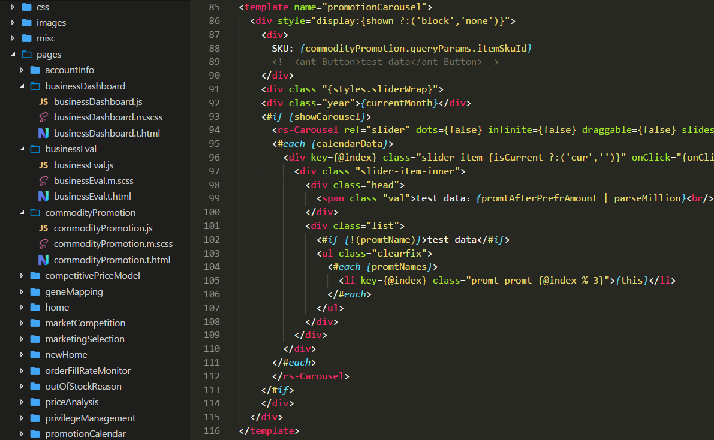

# NornJ-highlight

Syntax highlight and snippets for [NornJ template engine](https://github.com/joe-sky/nornj)

## Install

`ext install` in Visual Studio Code command line

Search for `nornj` and click install

## Syntax highlight screenshots



## Snippets screenshots


## Code Snippets

* Normal html tags, support all HTML tags

|trigger|snippet|
|-------|-------|
|`<div`|Defines a `<div>` tag|
|`<span`|Defines a `<span>` tag|
|`<input`|Defines a `<input>` tag|
|`<iframe`|Defines a `<iframe>` tag|
|`<textarea`|Defines a `<textarea>` tag|
|...|...|

* `NornJ` extension tags

|trigger|snippet|
|-------|-------|
|`<#if`|Defines a `<#if>` tag|
|`<#else`|Defines a `<#else>` tag|
|`<#elseif`|Defines a `<#elseif>` tag|
|`<#switch`|Defines a `<#switch>` tag|
|`<#case`|Defines a `<#case>` tag|
|`<#default`|Defines a `<#default>` tag|
|`<#unless`|Defines a `<#unless>` tag|
|`<#each`|Defines a `<#each>` tag|
|`<#for`|Defines a `<#for>` tag|
|`<#empty`|Defines a `<#empty>` tag|
|`<#props`|Defines a `<#props>` tag|
|`<#prop`|Defines a `<#prop>` tag|
|`<@propName`|Defines a `<@propName>` tag|
|`<#strProp`|Defines a `<#strProp>` tag|
|`<@@propName`|Defines a `<@@propName>` tag|
|`<#obj`|Defines a `<#obj>` tag|
|`<#list`|Defines a `<#list>` tag|
|`<#fn`|Defines a `<#fn>` tag|
|`<#tmpl`|Defines a `<#tmpl>` tag|
|`<#include`|Defines a `<#include>` tag|

## How to enable Emmet html snippets

Add the following setting:

```js
"emmet.includeLanguages": {
  "nornj": "html"
}
```

## License

MIT